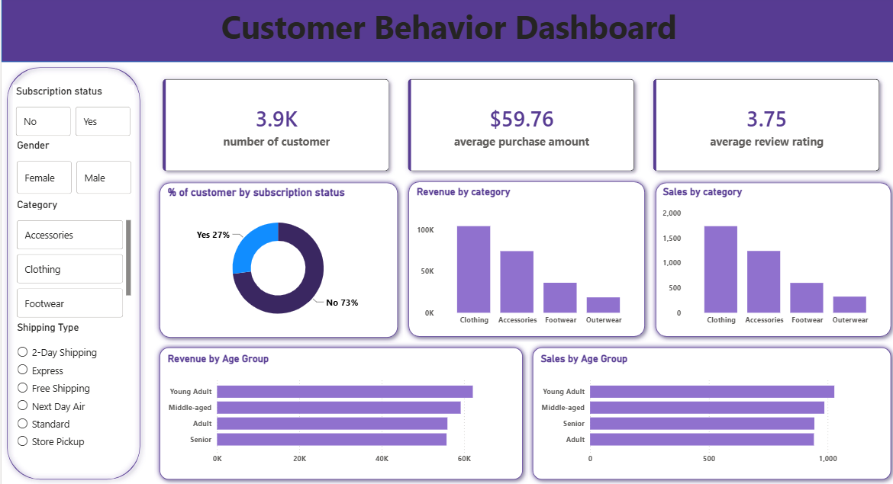

# Customer Shopping Behavior & Revenue Analysis

Customer segmentation and revenue analysis using Python, MySQL, and an interactive Power BI dashboard.

## Overview
Analyzed retail customer data to uncover purchasing patterns, demographic trends, and revenue drivers across product categories and age groups.

## Methods
- Data Cleaning (Python/Pandas) — resolved missing values via category-level median imputation, feature engineering
- SQL Analysis (MySQL) — CTEs and window functions (ROW_NUMBER) for customer segmentation and discount trend evaluation
- Dashboard (Power BI) — interactive dashboard with custom DAX KPIs and dynamic slicers

## Dashboard Highlights

- 3.9K customers analyzed
- $59.76 average purchase amount
- 3.75 average review rating
- Revenue and sales breakdowns by category, age group, and subscription status

## Files
- customer_shopping_behavior.ipynb — Python data cleaning and feature engineering
- customer_shopping_queries.sql — MySQL analysis queries
- customer_behavior_dashboard.pbix — Power BI dashboard file
- dashboard_screenshot.png — dashboard preview

## Tools
Python (Pandas), MySQL, Power BI, DAX
